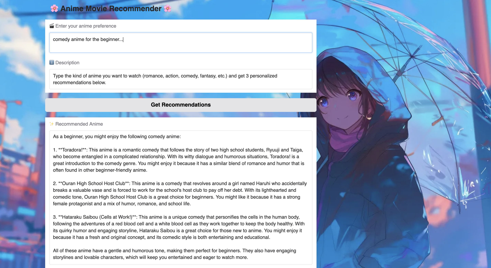

# 🌸 Anime Movie Recommender System 🎬

An intelligent **Anime Movie Recommender System** powered by **LangChain**, **LLMs**, and **Gradio** — with a beautiful anime-themed interface and AI-based recommendations.

---

## 🧠 Project Overview

This project uses **Large Language Models (LLMs)** and **LangChain** to recommend anime movies based on user preferences (e.g., “romantic comedy with a unique storyline”).

It embeds anime data, stores it in a **vector database (Chroma)**, and uses an **LLM (like LLaMA or Groq)** to retrieve the most relevant anime recommendations — all displayed via a stylish **Gradio web app**.

---

## 🚀 Features

✅ AI-powered anime recommendations  
✅ Interactive Gradio UI with anime-themed background  
✅ Uses LangChain for text retrieval and reasoning  
✅ Vector embeddings via HuggingFace  
✅ Background image with transparent or frosted-glass interface  
✅ Modular and easy to expand (add more data or models)

---

## 🧩 Tech Stack

| Component | Description |
|------------|-------------|
| **LangChain** | Framework for building LLM-powered pipelines |
| **LLM (Groq / LLaMA)** | The reasoning model generating anime suggestions |
| **HuggingFace Embeddings** | Converts anime descriptions into numerical vectors |
| **ChromaDB** | Vector store for semantic similarity search |
| **Gradio** | Beautiful, lightweight web interface |
| **Pandas** | Data loading and preprocessing |

---
## 🎨 UI Preview

Here's how the app looks in action! 👇



## ⚙️ Installation & Setup

### 1️⃣ Clone the Repository
```bash
git clone https://github.com/Hadiszare12/Anime-Recommender-LLM-.git
cd Anime-Recommender-LLM-
```

### 2️⃣ Create a Virtual Environment
```bash
python -m venv venv
source venv/bin/activate     # On Mac/Linux
venv\Scripts\activate      # On Windows
```

### 3️⃣ Install Dependencies
```bash
pip install -r requirements.txt
```

### 4️⃣ Add Your API Key
Create a `.env` file and add your Groq API key (or any other LLM provider):
```
GROQ_API_KEY=your_api_key_here
```

---

## 💡 How It Works

1. **Preprocess Data** → Loads anime titles, genres, and synopses.  
2. **Create Embeddings** → Converts text into vectors using HuggingFace.  
3. **Build Vector Store** → Stores embeddings in Chroma for quick retrieval.  
4. **LLM Query** → Groq’s model (e.g., `llama-3-70b-instruct`) finds relevant anime.  
5. **Gradio UI** → Lets users enter preferences and view personalized results.  

---

## 🎨 UI Preview

The app uses a custom anime-style background and transparent text boxes.

Example section of the UI:

```python
.gradio-container {
    background-image: url("https://anime_bg.jpg");
    background-size: cover;
    background-position: center;
}
```


---

## ▶️ Run the App

```bash
python app.py
```

The Gradio interface will launch at:

👉 **http://127.0.0.1:7860**

Then, simply type your preference:
> “I want a lighthearted romantic comedy anime.”

And get instant AI recommendations!

---

## 💬 Example Query

**Input:**
> “Can you recommend a fantasy anime with strong character development?”

**Output:**
```
1️⃣ Fullmetal Alchemist: Brotherhood — Deep themes and emotional growth.
2️⃣ Attack on Titan — Strong narrative and character arcs.
3️⃣ Made in Abyss — Unique world and heartfelt storytelling.
```

---

## 🌟 Future Enhancements

- 🎞️ Add anime cover images in results  
- 📈 Add similarity scoring  
- 💬 Integrate voice-based queries  
- 🤖 Fine-tune a domain-specific anime LLM  

---

## 🧑‍💻 Author

**Hadis Zare**  
📧 Profi.hadiszare@gmail.com
💼 [LinkedIn](https://linkedin.com/in/hadiszare) | 🐙 [GitHub](https://github.com/Hadiszare12)

---

## 🪄 License

This project is licensed under the **MIT License** — free to use and modify.

---

⭐ If you like this project, don’t forget to **star** the repo on GitHub!
